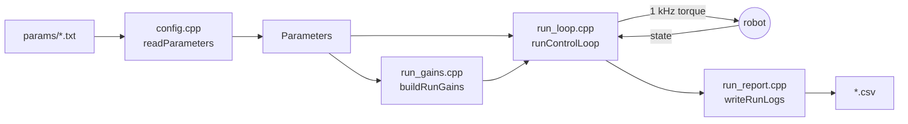
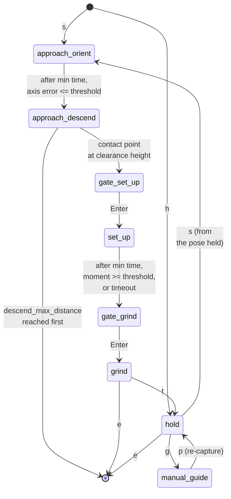

# Approach / Set-Up / Grind Controller

A Cartesian impedance controller for the Franka arm. It brings a hand-held tool
down onto a virtual plane, lets contact seat it flat, then grinds along the
surface. It can also simply hold a pose, which is how the nullspace behaviour
is studied.

## The files

`main.cpp` is the entry point; `run/` is what one run does, one file per step;
`modules/` is what those steps call.

| Folder / file | Contents |
|------|----------|
| `main.cpp` | Connects the robot, then loops: menu -> run -> report |
| `run/run_gains.cpp` | Every stiffness and damping matrix, and the auto damping |
| `run/run_loop.cpp` | One run: the phase machine and the 1 kHz control law |
| `run/run_report.cpp` | The post-run printout and the CSV |
| `modules/control_math.cpp` | Mathematics: task frames, gains, control law, nullspace |
| `modules/runtime_io.cpp` | Menus, gripper actions, debug printing, CSV writing |
| `modules/config.cpp` | Reads `params/` into one `Parameters` struct |
| `modules/setup_report.cpp` | The one-shot report printed when set up ends |
| `controller.h` | Shared types and all declarations |
| `tools/*.cpp` | Read-only helpers, listed at the end |
| `params/*.txt` | Every tunable value, one topic per file |
| `build/` | Object files. `make clean` removes it |
| `logs/` | The CSVs a run writes. Created on the first write |

`params/*.txt` holds every tunable value, one topic per file. Nothing is
compiled in: change a number there, not in the source.



**Reading it for the first time:** `run/main.cpp` (114 lines) shows the shape
of a session; `controller.h` shows every type and parameter; `run/run_loop.cpp`
is where the control happens.

## Build and run

```bash
make
./surface_grinding_controller
```

The startup menu appears first. The robot does not move until you choose.
`e+Enter` stops at any time, `m+Enter` returns to the menu, and a bare `Enter`
passes a phase gate.

## Startup menu

```text
====================================================================
  STARTUP MODE
====================================================================
  run     s   run the phase sequence from q_init
          h   hold the q_init pose
          t   hold with the set-up impedance, to test those gains
          g   hand-guide the start pose, then choose
--------------------------------------------------------------------
  set up  q   go to q_init and inspect
          o   open the hand now
          c   grasp the tool now
          r   recalibrate the hand width, fingers empty
          f   fetch the tool from the holder
          b   put the tool back
--------------------------------------------------------------------
  quit    e   stop and quit
--------------------------------------------------------------------
  in a run    e stop | m menu | g hand-guide | s sequence | t hold
--------------------------------------------------------------------
Choice [s/h/t/g/q/o/c/r/f/b/e]:
```

`f` opens the hand, travels via q_init to the stored pickup posture and
grasps; `b` does the reverse and releases there. Both leave the arm at the
pickup posture and need `use_tool_pickup = 1` plus a measured `q_pickup_*` in
`Gripper_Action.txt` — guide the arm to the tool, press `e`, and paste the
pose it prints.

`o`, `c`, `q` and `r` act now and return to the menu. Recalibration is the
Franka Hand homing procedure: it opens the fingers fully, so it prints the
warning and starts on one Enter — anything else typed aborts, and the tool must
be supported or removed. `r` does the same from the guiding menu.

**During any run:** `e+Enter` stops, `m+Enter` comes back to this menu,
`s+Enter` runs the sequence from a hold and `t+Enter` holds with the set-up
impedance. A second run in the same program start writes
`surface_grinding_controller_log_s2.csv`, so the first run's log survives.

## Modes

```text
Sequence (s)
  1 approach  orient the tool onto the plane normal, then descend
  2 set up    press the contact edge in; contact moment rotates the tool flat
  3 grind     hold the press and sweep along a surface tangent
  Tunes: Approach_Phase, Clearance_Gate, SetUp_Phase, Grind_Phase.

Hold (h)
  Locks the pose it starts from and asks for the nullspace mode 0-3.
  Nullspace can also arm the bounded link-point push used by Case F.
  From hold, g+Enter hand-guides and p+Enter re-captures the pose.
  While holding, "d 3.5", "k 1.2" and "a 5" retune the nullspace damping,
  the sigma push and the probe alpha (typed in degrees) without stopping the
  run, and 0/1/2/3 switch the mode.
  Tunes: hold, Nullspace.

Set-up impedance hold (t)
  The same hold, but commanding what phase 2 commands: setup_Kp/Dp/KR/DR,
  and the coupled pole spring when use_coupled_stiffness = 1. There is no
  push ramp -- it holds the captured pose, so the set-up spring can be
  pushed by hand and measured on its own. Like a sequence run it takes the
  nullspace mode from Nullspace.txt instead of asking, so the two cannot
  drift apart. While it holds, "kp3 900" [N/m], "kr1 8" [Nm/rad] and
  "pc1 -40" [mm] retune the spring and rebuild it in place, and "t1 10",
  "t2 -5" [deg] set the tilt the next sequence will command -- which changes
  nothing while the hold holds its captured pose, and everything the moment s
  starts. The compliance
  centre can be typed in any of the three frames it can be named in, whatever
  the run stores: pc1..pc3 place the pole on the tool from p_EE, r1..r3 give
  the lever r_c in the plane, pe1..pe3 place the pole from the contact edge.
  The block prints r_c alone, the row that is typed and that holds still
  while the hold holds: p_c moves in the tool at every tilt, and beside r_c
  it reads as a second setting rather than the same lever. The phase block
  and the set-up report keep both. A key in another frame is converted at the
  moment it is typed, and stops being exact once the tool turns -- that is
  the difference between the conventions, not a rounding of it. Three
  conventions, tried in this order:
    coupled_use_pole_ee          pc1..pc3, a point on the tool from p_EE.
                                 Rides with the tool, so the same numbers are
                                 the same place at every tilt and in the press
                                 as in this hold. pc = 0 puts the pole at the
                                 TCP, which is the decoupled spring exactly;
                                 pc3 = 20 puts it on the grinding face.
    coupled_use_direct_rc_surface  r1..r3, r_c in [t1,t2,n] of the plane.
    (neither)                    pc1..pc3, the legacy pole from the contact
                                 edge. Note 0 there is the pole AT the edge,
                                 not at the TCP.
  s+Enter then runs the sequence with exactly those gains and t+Enter comes
  back to this hold, at the pose it started from, so tuning and trying
  alternate without leaving the run.
  Tunes: SetUp_Phase, Nullspace.

Guiding (g)
  Compliant hand-guidance; the pose you leave becomes the start pose.
  Tunes: guidance.
```

Every mode also reads `Run_Settings`, `Plane_Definition`, `Tool_Orientation`,
`Tool_Geometry`, `Q_Init`, `Gripper_Action`, `Auto_Damping` and `safety`.

The sequence is a state machine. Transitions are geometric or timed, never
force-triggered:



The two gates are optional (`pause_before_set_up`, `pause_before_grind`); with
them off the run passes straight through.

`s` starts from the pose the arm is holding, so nothing moves at the switch
itself. `t` is accepted from any sequence phase, including from a gate or from
the grind: it takes the pressed pose the sequence reached and walks the
commanded pose back to where the hold started, at `descend_speed` and
`approach_orient_max_rate_deg`, then holds there. That is what makes the cycle
repeatable — every set-up is tried from the same place, not from wherever the
last one was stopped. `s` is refused while that return is still running, and it
keeps the plane the run started with, so repeating the cycle cannot walk the
surface point deeper.

## Parameter files

Read and merged in this order; keys are disjoint, so a key lives in exactly one
file. `parameterFiles()` in `config.cpp` owns the list.

| File | Contents |
|------|----------|
| `Run_Settings.txt` | Robot IP, run duration, CSV logging, debug period |
| `safety.txt` | Franka collision and reflex thresholds |
| `Gripper_Action.txt` | The gripper action performed once after q_init |
| `Auto_Damping.txt` | Global damping limits |
| `Plane_Definition.txt` | The surface: point, tilt angles, tangent1 |
| `Tool_Orientation.txt` | Tool axis, commanded offsets, rotation mask |
| `Tool_Geometry.txt` | The grinding face: center, half-width, half-length |
| `Q_Init.txt` | `q_init_case` and the start postures |
| `Approach_Phase.txt` | Orient thresholds, approach impedance, descend |
| `Clearance_Gate.txt` | Clearance height and the Enter gates |
| `SetUp_Phase.txt` | Press ramp, impedance, coupled (pole) stiffness |
| `Grind_Phase.txt` | Sweep axis, amplitude, frequency |
| `Nullspace.txt` | Nullspace mode, gains and sigma diagnostics |
| `hold.txt` | Hold gains and hold damping |
| `guidance.txt` | Hand-guidance start |

Each phase can compute its damping online as `D = factor*2*sqrt(M*K)` from the
libfranka task-space inertia. The manual `Dp`/`DR` beside each `K` is the
fallback when the toggle is off or the inertia estimate is unavailable.

---

The rest is reference material. You can run an experiment without it.

## Surface plane and task frame

The constrained surface is a plane in the base frame, `n^T*(p - p_surface) = 0`,
oriented by two tilt angles:

```text
n = R_y(b) * R_x(a) * [0,0,1] = [sin(b)cos(a), -sin(a), cos(b)cos(a)]
```

`a` tilts about base x, `b` about base y. The task frame has column order
`[tangent1, tangent2, normal]`; only `alignment_target_tangent1` is entered and
`tangent2 = normal x tangent1` follows. Every `*_tangent1/_tangent2/_normal`
gain triple is written in that frame and rotated to the base frame as
`K_base = R * K_task * R^T`.

With zero command offsets, alignment enforces
`R_desired * tool_axis_ee = tool_axis_target_sign * alignment_target_normal`.
The `tool_target_offset_*_deg` values rotate that commanded axis for
misalignment experiments; they change nothing else — not the plane, the
clearance geometry, the gain axes, or the alignment metric.

The phase 1 to phase 2 switch is **geometric**: it fires at the clearance
height above the plane. External force is printed during the descent but never
decides anything.

## Decoupled vs coupled stiffness

The default law is decoupled: two independent 3x3 springs, force from position
error and moment from rotation error.

The coupled law commands one 6x6 spring, the same diagonal spring moved from a
pole out to the TCP through the adjoint:

```text
K_TCP = Ad(r_c)^T * blockdiag(Kp, KR) * Ad(r_c),   r_c = p_TCP - pole
Ad(r_c) = [[I, skew(r_c)], [0, I]]
```

The off-diagonal quadrants are the lever coupling: rotation produces force and
translation produces moment. The congruence keeps the spring positive
semi-definite; the preflight and the set-up report print its eigenvalues.

Two sources for the 6x6 gains:

1. `coupled_use_block_diagonal = 1` reproduces the decoupled wrench exactly
   through the 6x6 path — the sanity check that the path itself is correct.
2. `coupled_pole_manual = 1` rebuilds from a commanded lever. New experiments
   set `coupled_use_direct_rc_surface = 1` and give `coupled_rc_*` as
   `r_c = p_TCP - p_c`; archived setups may still use the legacy
   `coupled_pole_from_edge`.

Calibrated runs also set `setup_translation_surface_frame = 1`, which reads
`setup_Kp_surface_*` in `[tangent1,tangent2,normal]` instead of base XYZ.

## Nullspace

The projector comes from an SVD Moore-Penrose inverse, `N_tau = (I - J+ J)^T`.
The four laws are:

```text
off:       tau = 0
damping:   tau = -d_null * N_tau * dq
sigma:     tau = k_sigma * sign * N_tau * n
both:      tau = -d_null * N_tau * dq + k_sigma * sign * N_tau * n
```

`n` is the one-dimensional Jacobian nullspace direction. Its sign is chosen by
comparing `sigma_min(q + alpha*n)` against `sigma_min(q - alpha*n)`; `alpha` is
only the sampling step and does not scale the torque.

Mode 1 uses `nullspace_damping`, mode 2 uses `nullspace_k_sigma`, mode 3 uses
both — so the isolated terms and the combined response can be tuned
independently and compared from the same hold pose.

The configured sigma-torque default is 2 Nm. In the automatic hold study,
1 Nm was largely below the joint-friction threshold, whereas 2 Nm produced
observable redundant motion. Mode 2 has no projected damping; settings above
2 Nm therefore require a separate task-drift and oscillation screening run.

### Sigma debug output

With `print_sigma_debug = 1`, a mode 2 or 3 hold prints one rate-limited block:

```text
min      current sigma_min
d/dt     change of sigma_min between debug lines
probe    abs(sigma_plus - sigma_minus)
C        probe/deadband (C <= 1 disables the sigma push)
|grad|   probe/(2*alpha), for comparing alpha trials
tau      norm of the commanded sigma torque
vN       absolute nullspace joint speed
vBest    signed speed toward the better-sigma direction
nBest    sign-selected unit joint direction that improves sigma_min
dqN      projected nullspace velocity of q1..q7
tauS     commanded sigma torque per joint
```

Reading it: after releasing a manual push, a useful comeback has `vBest > 0`
and usually `d/dt > 0`. Persistent `C <= 1` while the arm is visibly away from
its better configuration means `alpha` is not separating the two directions;
near the optimum `C <= 1` is expected. Active `tau` with `vN` near zero means
`k_sigma` is too weak. The raw `sigma_direction` sign can flip with the
arbitrary SVD vector sign, so judge behaviour by `vBest`, the probe magnitude
and the sigma trend.

Every such hold is also buffered to `surface_grinding_controller_sigma_debug.csv`
and written at 20 Hz **after** the stop — there is no file I/O inside the 1 kHz
callback. A collision or exception still saves the partial trace. The `event`
column separates `hold_start`, `manual_guide_start`, `recapture`, `sample`,
`stop` and `exception`; each `p+Enter` increments `segment_id` and resets
`phase_time_s`, so push-and-release trials compare cleanly. Release the arm
before pressing `p`, or the new external-torque baseline includes your hand.

Set `print_sigma_debug = 0` for timing-sensitive runs and use the CSV instead.

## Read-only tools

None of these command motion.

```bash
make check_tool_offset          # prints the configured F_T_EE / EE_T_K
make capture_plane_point        # tools/capture_plane_point horizontal P1..P4
make capture_tool_axis          # tools/capture_tool_axis grinding_tool horizontal T1..T4
make inspect_experiment_config  # offline frame/gain/sign preflight
make home_gripper               # standalone Franka Hand homing
```

For `capture_tool_axis`, put the complete face flat on a validated plane and
vary only yaw between samples. The invariant axis is estimated from the EE
rotations; the plane normal is only a validation check.
